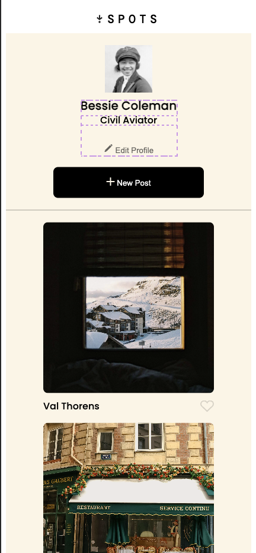

# SPOTS

Put a **SPOT**light on your favorite destinations!

## Description

A new Social Media app that allows users to share their favorite pictures from their favorite destinations. Users will be able to make their own profile and share their own content. The posts consist of an image and a description, to tell other users what/where the photo is taken.

## Technology

Spots utilizes:

    - HTML
    - CSS
    - Responsive Design
    - BEM Methodology
    - Flexbox/FlexGrid

## Current Features

### 1. Profile Cutomization

### 2. Create New Posts

### 3. Iphone Compatibility!

## `!!!WEBSITE LINK!!!`

[Click here to start your journey!](https://bombingrun3.github.io/se_project_spots/)

## Future Goals

Below is a list of SPOTS `FUTURE` implementations.

### 1. Video Posts

Right now SPOTS does not support video, but future iterations hope to implement that feature.

### 2. Friends **SPOTS**light

Currently, you can only view your own profile and content, but in future iterations, we will add a feature to search and favorite your friend's posts.

### 3. Sharing is Caring

We would also like to implement a feature of being able to share content from Spots directly to your other Social Media accounts.

### 4. Put a Pin in it!

Users will be able to pin the location of where the photo was taken so that other adventurers can make their own memories there as well.

#### Video Submission

Here is the video link as requested by Triple Ten for Sprint 3

[Sprint 3 Video](https://drive.google.com/file/d/1VMLclz9XolGw4z6ifT-qHVvpDvl80IAO/view?usp=sharing)
